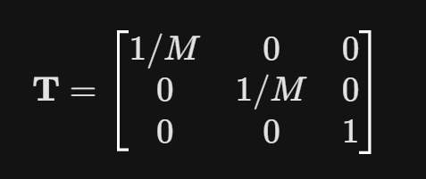
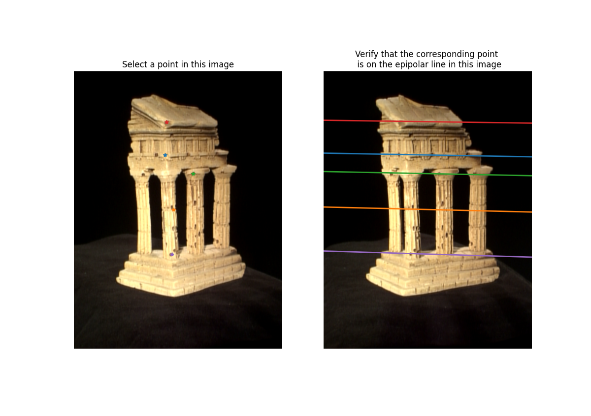
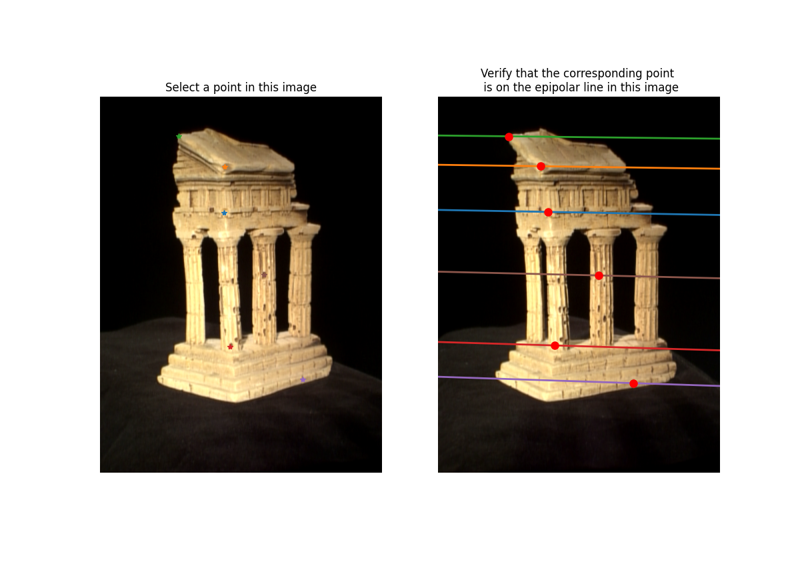
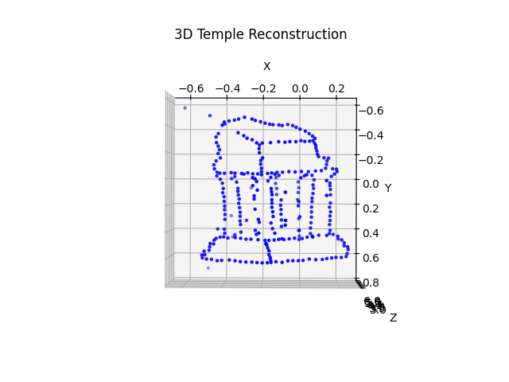

# Sparse-3D-Reconstruction
## Overview

This performs a 3D reconstruction of a scene (specifically a temple) from a pair of stereo images. It utilizes principles of epipolar geometry to estimate the Fundamental matrix, find corresponding points between the two images, compute the Essential matrix, extract camera poses, and finally triangulate the 2D points to generate and plot a 3D point cloud.

## 1. Implement the eight point algorithm

- **eight_point(pts1, pts2, M):** The fundamental matrix computation is highly sensitive to noise and the scale of the image coordinates. We normalize the points to improve the numerical stability of the SVD.

- **epipolar_correspondences(im1, im2, F, pts1):** Finds corresponding coordinates in the second image for a given set of points in the first image by searching along the epipolar line. 
For each point in im1, it extracts a 15*15 window. It computes the corresponding epipolar line in im2 and slides a window across this line, using Sum of Squared Differences (SSD) to find the best matching patch.
- For every pair of corresponding normalized points x1 and x2, the epipolar constraint is:

- The fundamental matrix calculated from the equations is shown below:
    
    Fundamental Matrix F:
    [[ 2.52874524e-09 -5.60294317e-08 -9.27849009e-06]
    [-1.33006796e-07  7.08991923e-10  1.12443633e-03]
    [ 2.81490965e-05 -1.08098447e-03 -4.51123569e-03]]
    

- Visualization of some epipolar lines :

## 2. Find epipolar correspondences

## 3. Compute the essential matrix

**essential_matrix(F, K1, K2):** Computes the Essential matrix from the Fundamental matrix and camera intrinsics.

**Essential matrix E:**
[[ 5.84548837e-03 -1.29987069e-01 -3.39748366e-02]
[-3.08572889e-01  1.65079610e-03  1.65468710e+00]
[-5.96270630e-03 -1.67505406e+00 -1.91346162e-03]]

**How to determine which extrinsic matrix is correct?**

Decomposing the Essential matrix gives you 4 mathematically valid camera configurations (combinations of rotation and translation).
To find the physically correct one, you must apply the **chirality condition**: the triangulated 3D points must appear in front of both cameras.
You triangulate the points for all 4 candidate  matrices. The correct matrix is the one that produces the most 3D points with a positive Z coordinate (depth) relative to both camera centers.

**Reprojection error:** 1.0792756060105313

**Execution Flow**
1. Data Loading: Image pairs and initial correspondence points are loaded. A scaling factor M is defined based on the image size.
2. Fundamental Matrix Estimation: eight_point is called to compute **F**.
3. Dense Point Matching: Dense template coordinates are loaded, and epipolar_correspondences finds their exact matches in the second image using the epipolar constraint.
4. Essential Matrix & Camera Pose: **E** is computed. Assuming Camera 1 is at the world origin, camera2(E) generates 4 possible candidate poses for Camera 2.
5. Chirality Check (Disambiguation): The script iterates through the 4 candidate P2 matrices. For each, it triangulates the 3D points. It filters out the incorrect camera matrices by enforcing the constraint that the reconstructed 3D points must have a positive depth (Z > 0) in both camera coordinate frames.
6. Error Calculation: Computes the reprojection error for the correct 3D point cloud to measure accuracy.
7. Visualization: Generates a 3D scatter plot of the resulting best_pts3d array, displaying the reconstructed geometry of the temple.

## Snippet of 3D temple reconstruction:

